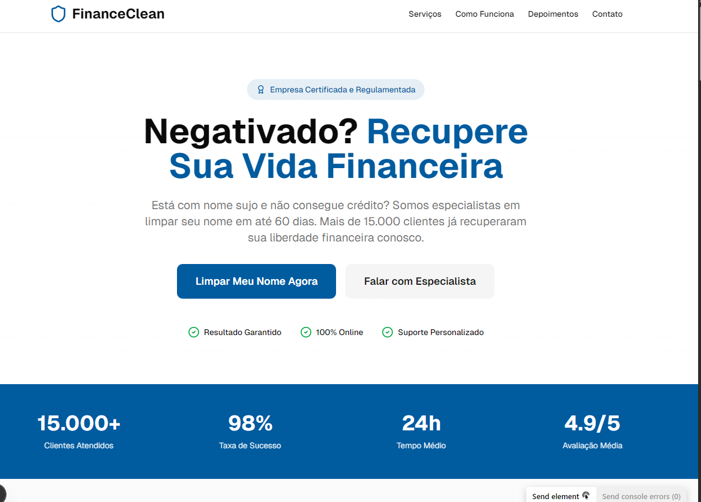

# FinanceClean - Limpeza de Nome Profissional



## Sobre o Projeto

Site profissional para serviços de limpeza de nome e proteção de crédito. Desenvolvido com Next.js 16, TypeScript e Stripe para pagamentos PIX seguros.

## Funcionalidades

- Página Principal com design profissional e responsivo
- Pagamentos PIX integrados com Stripe
- Design Responsivo para todos os dispositivos
- Processamento Seguro com Server Actions
- Performance Otimizada com Next.js

## Stack Tecnológico

- Frontend: Next.js 16, React 19, TypeScript
- Styling: Tailwind CSS, shadcn/ui
- Payments: Stripe (PIX)
- Deployment: Vercel
- Version Control: Git & GitHub

## Deploy

Seu site está disponível em:
[https://financeclean-pro.vercel.app](https://financeclean-pro.vercel.app)

### Como fazer deploy:

1. Clone o repositório:
   ```bash
   git clone https://github.com/Gustav-Smith/v0-product-sales-website.git
   cd v0-product-sales-website
   ```

2. Instale as dependências:
   ```bash
   npm install
   ```

3. Configure as variáveis de ambiente:
   ```bash
   cp .env.example .env.local
   # Adicione suas chaves do Stripe
   ```

4. Rode localmente:
   ```bash
   npm run dev
   ```

5. Faça deploy na Vercel:
   ```bash
   npm run build
   # Importe no Vercel: https://vercel.com/new
   ```

## Contato

- WhatsApp: (61) 99291-0841
- Email: gustavojeanpt@gmail.com
- Horário: 9h às 18h

## Licença

Este projeto é privado e todos os direitos são reservados.

---

Desenvolvido com para FinanceClean
